# VLSI Physical Design Flow — Notes

A structured summary of the ASIC physical design flow: floorplanning, power
distribution, standard cell design, and timing characterization.

---

## 1. From Schematic to Physical Blocks

A simple pipeline `FF → AND (A1) → OR (O1) → FF` clocked by `Clk` is first
drawn logically, then each gate/flip-flop is converted into a physical
rectangular block with defined pins (`D`, `Q`, `a`, `b`, `y`) so it can be
placed on silicon.

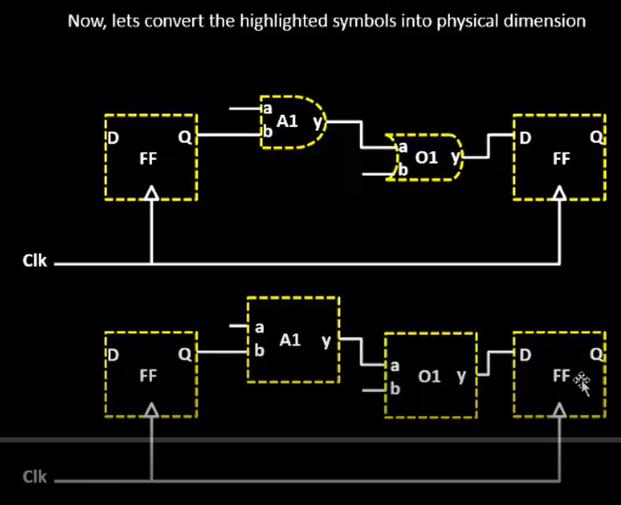

---

## 2. Floorplanning

### Step 1 — Define Width & Height of Core and Die
- **Die**: the outer boundary of the chip.
- **Core**: the inner region where logic is actually placed.
- **Utilization Factor** = (area of standard cells) / (core area).
  Example: 4-unit core containing a 2×2-unit block of logic → utilization = 0.25.
- **Aspect Ratio** = height / width of the core (1 = square core).

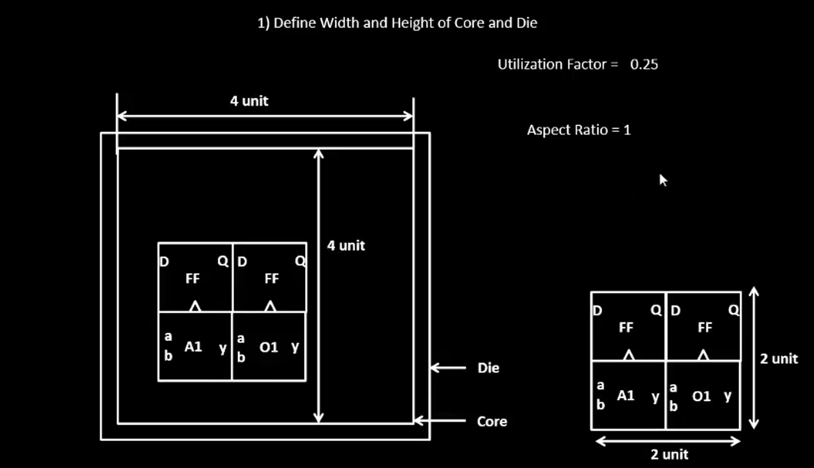

### Step 2 — Define Locations of Preplaced Cells
- Combinational logic (e.g., a chain of AND/OR/NAND gates `A1…A8`) is grouped
  into logical **cuts** (cut1, cut2, …) based on connectivity/hierarchy.
- Related gates are grouped into **Blocks** (Block 1, Block 2), each with
  well-defined inputs/outputs.

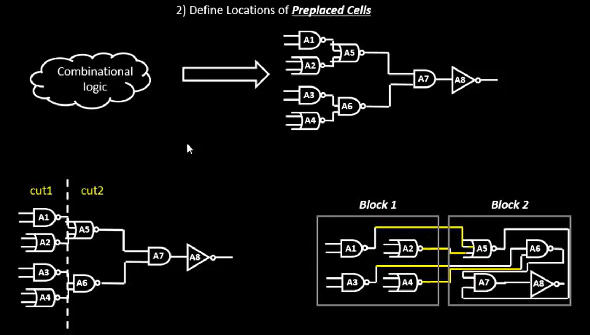

- Blocks are then **black-boxed** — abstracted into simple I/O rectangles
  (inputs `a, b, c, d`; outputs `o1…o4`) — so they can be treated as
  independent hard macros/IPs during floorplanning.
- These black-boxed blocks are placed as **preplaced cells** in the floorplan.

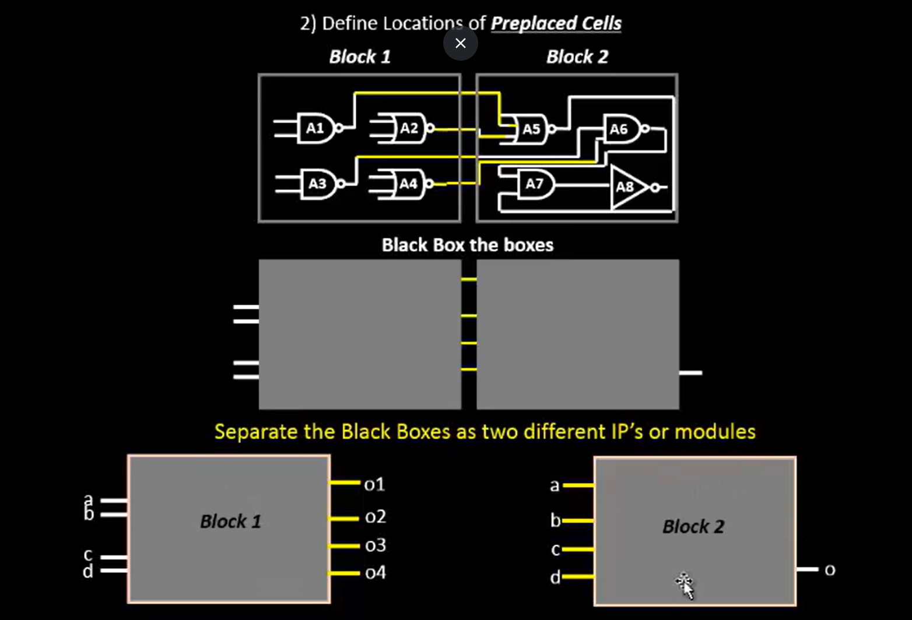

### Step 3 — Surround Preplaced Cells with Decoupling Capacitors (DECAPs)
- DECAP rows (DECAP1, DECAP2, DECAP3…) are inserted around/between
  preplaced blocks (Block a, Block b, Block c) to locally supply charge and
  suppress supply-voltage droop during switching.

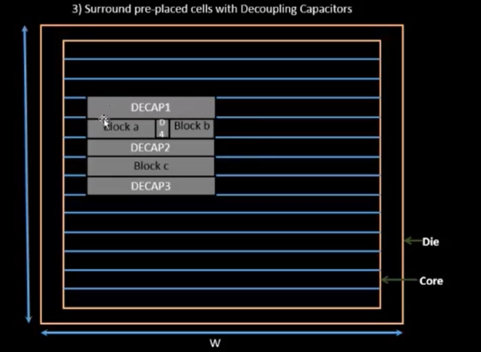

### Step 4 — Optimize Placement
- Standard cells (FF1, FF2, buffers, gates "1"/"2") are placed row-wise
  across the core, close to the pins they connect to (Din/Dout, Clk).
- This is the stage where **wire length and capacitance are estimated**,
  and **repeaters/buffers are inserted** based on that estimate to fix
  long/slow nets.

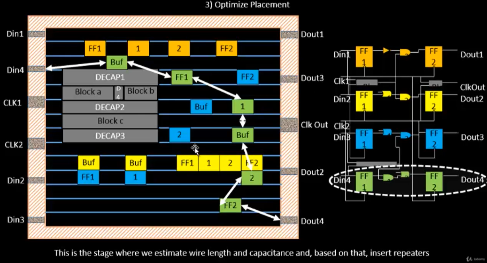

### Step 5 — Power Grid (Vdd / Vss straps and rings)
- Horizontal/vertical **Vdd** (blue) and **Vss** stripes form a grid over the
  core, connected at **contacts** (yellow ×) wherever they cross standard
  cell rows.
- This grid distributes power uniformly and lowers IR drop / inductive
  bounce at each cell.

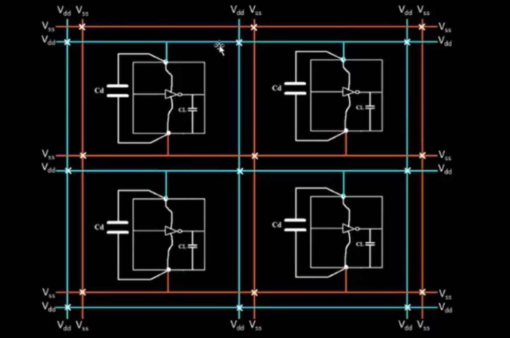

### Step 6 — Logical Cell Placement Blockage
- Areas already occupied by DECAPs/macros are marked as **placement
  blockages** so the placer doesn't drop new standard cells there.
- Once the power grid, blockages, and preplaced macros are defined, the
  **floor plan is ready for Placement & Routing (P&R)**.

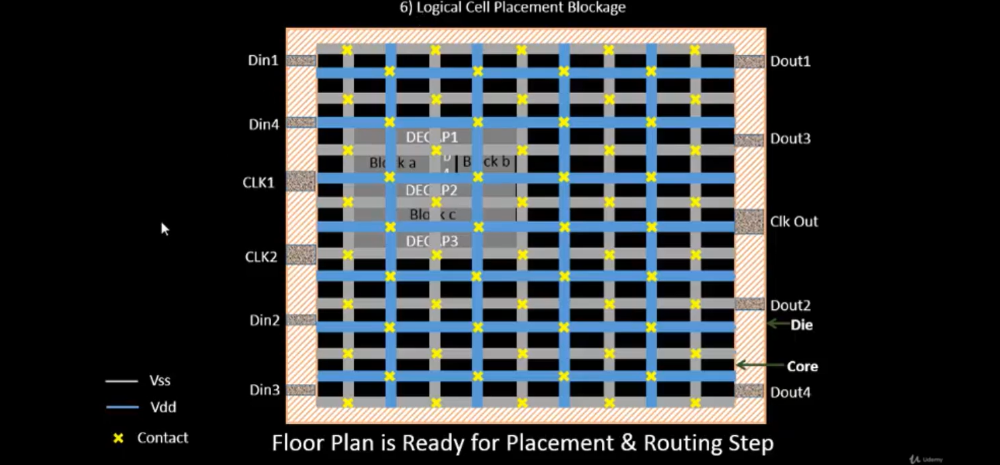

### Netlist ↔ Floorplan ↔ Physical View
- The final connectivity of the design (FF1 → gate1 → gate2 → FF2, per
  channel, plus shared Clk/Block a/b/c) is captured in **VHDL/Verilog**,
  called the **netlist**.
- The floorplan (physical layout), the netlist (logical connectivity), and
  the physical view of the standard-cell rows are three consistent
  representations of the same design.

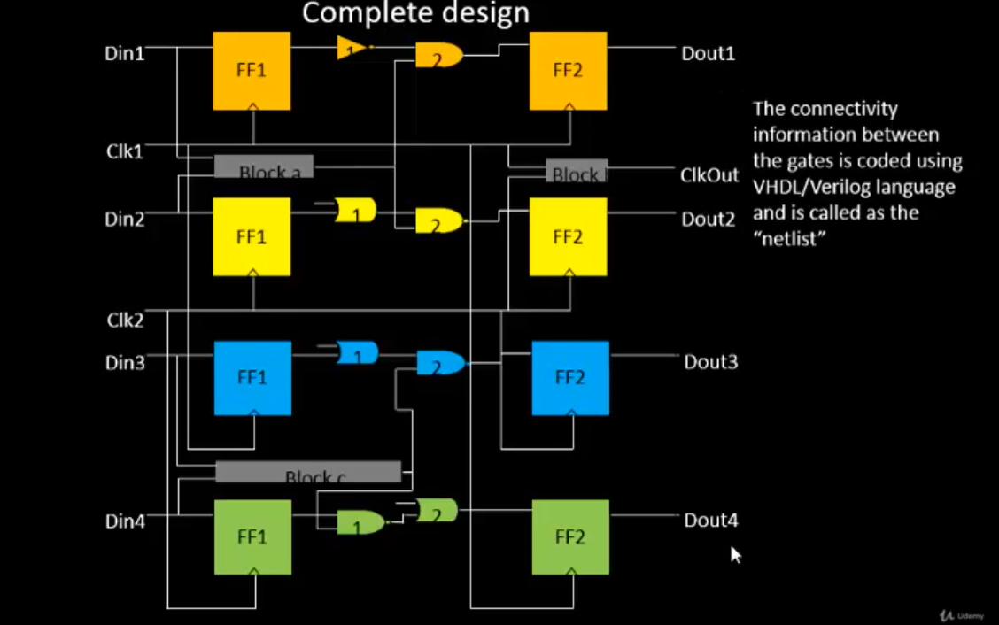

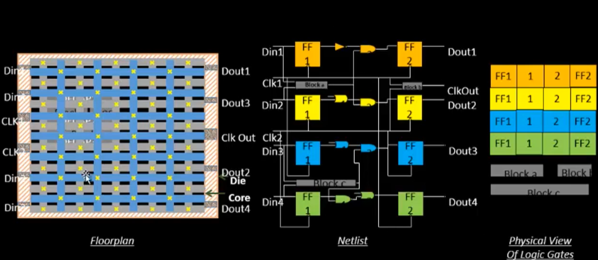

---

## 3. Power Integrity Concepts

### Switching Current & IR/Ldi-dt Drop
- Every driver/receiver flip-flop pair (Din→Dout) draws switching current
  `Idd`/`Iss` through parasitic **Rdd/Ldd** (top) and **Rss/Lss** (bottom)
  of the power delivery network.
- If `Vdd'` (the effective voltage seen by the circuit) drops below the
  noise margin because of `Rdd`·`I` and `Ldd`·`di/dt` drops, a logic **'1'**
  driven by one stage may not be correctly detected as **'1'** by the next
  stage.

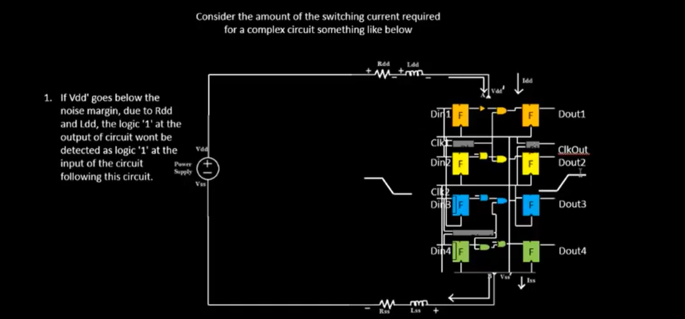

### Noise Margin Summary
- Valid logic levels are defined by four thresholds: `Vol`, `Vil`, `Vih`, `Voh`.
- `NML` (low noise margin) = `Vil − Vol`; `NMH` (high noise margin) = `Voh − Vih`.
- A noise "bump" on the signal is safely read as:
  - **Logic 0** if it stays below `Vil`.
  - **Undefined** if it lands between `Vil` and `Vih`.
  - **Logic 1** if it stays above `Vih`.
- Any valid signal must remain within the `NML`/`NMH` bands to be reliably
  read as 0/1.

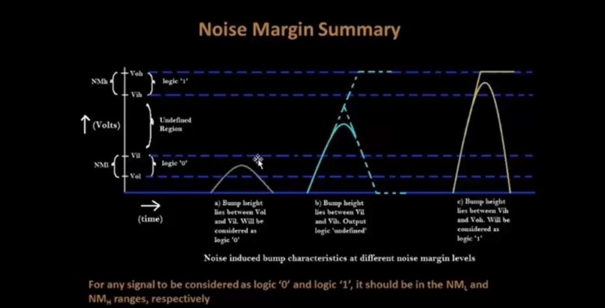

### Bus Switching & Voltage Droop
- For a multi-bit bus (e.g., 16-bit), when many bits switch simultaneously
  (e.g., pattern `000110100011 1001`), all capacitors charging from **0 → V**
  draw current through the *same* single `Vdd` tap point.
- This simultaneous demand causes a **voltage droop** at the tap — worse
  as more bits switch together (simultaneous switching noise, SSN).

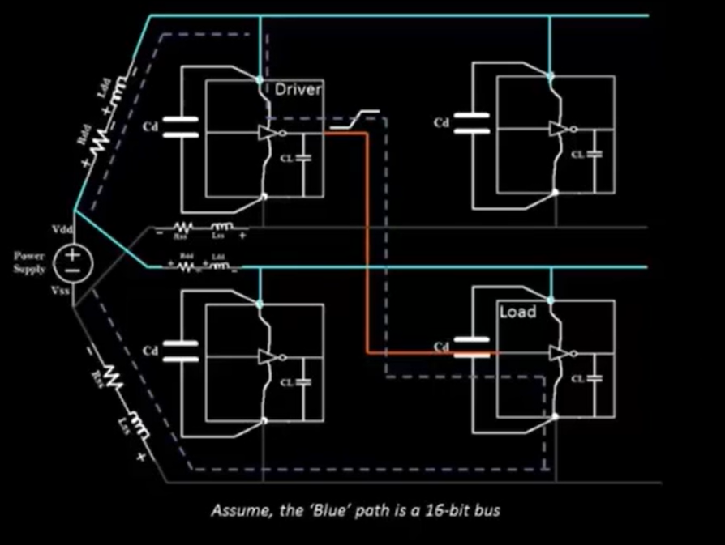

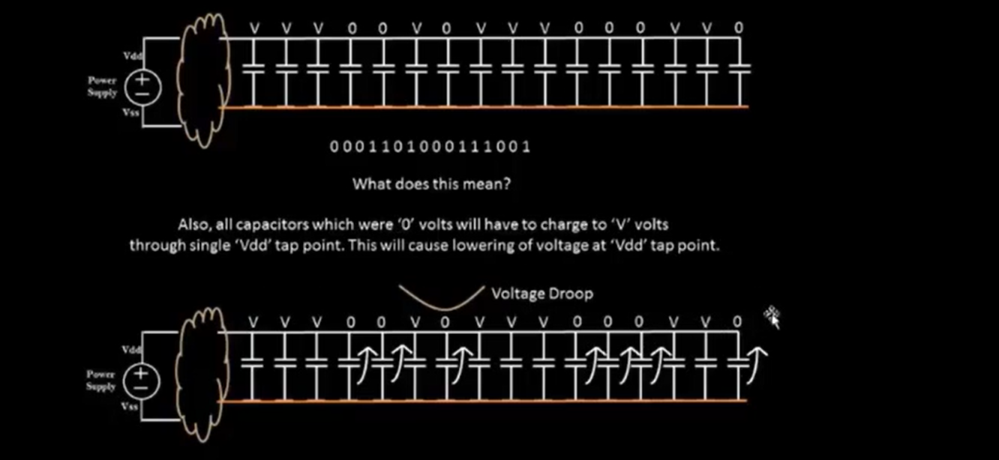

---

## 4. Standard Cell Design Flow

### Library Concept
- After placement/routing at the block level, every unique combination of
  {gate type, drive size, threshold voltage (Vt) flavor} becomes a
  **standard cell** entry:
  - *Different functionality*: `and`, `or`, `buf`, `inv`, `FF`, `latch`, `ICG`…
  - *Different sizes*: Size1, Size2, Size3 (different drive strengths).
  - *Different Vt flavors*: high-Vt (HVT, low leakage/slow) vs low-Vt
    (LVT, fast/leaky), etc.
- All combinations are collected into a **standard cell library**.

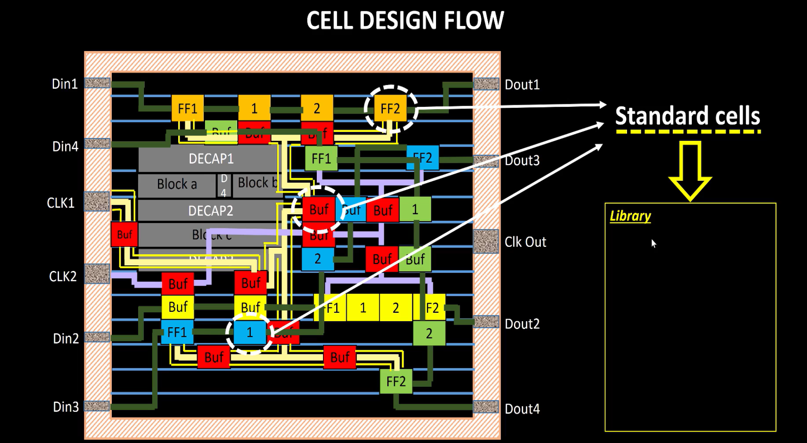

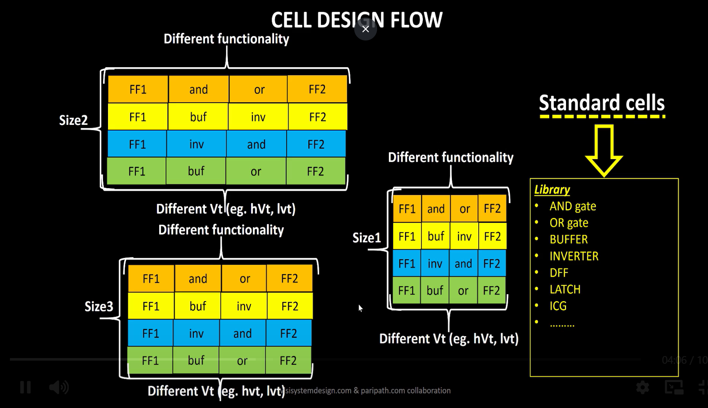

### Inputs / Steps / Outputs of Cell Design
- **Inputs**: Process Design Kits (PDKs) — DRC & LVS rules, SPICE
  transistor models, library and user-defined specs.
- **Design steps**: circuit design → layout design → characterization.
- **Outputs**: CDL (circuit description language), GDSII (layout), LEF
  (abstract physical view), and extracted SPICE netlist (`.cir`).

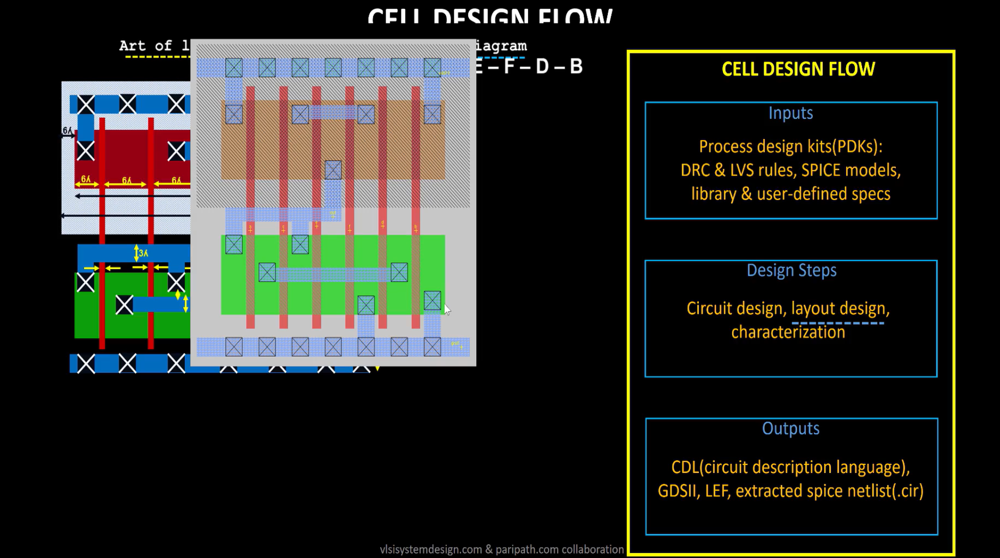

- SPICE model parameters (e.g., `VTH0`, `K1`, `K2`, `U0`, `RDSW`, `CGSO`…)
  feed directly into the MOSFET **threshold-voltage equation**
  `Vt = Vt0 + γ(√|−2Φf + Vsb| − √|−2Φf|)` and the **linear**/**saturation**
  drain-current equations used to size and verify each cell.

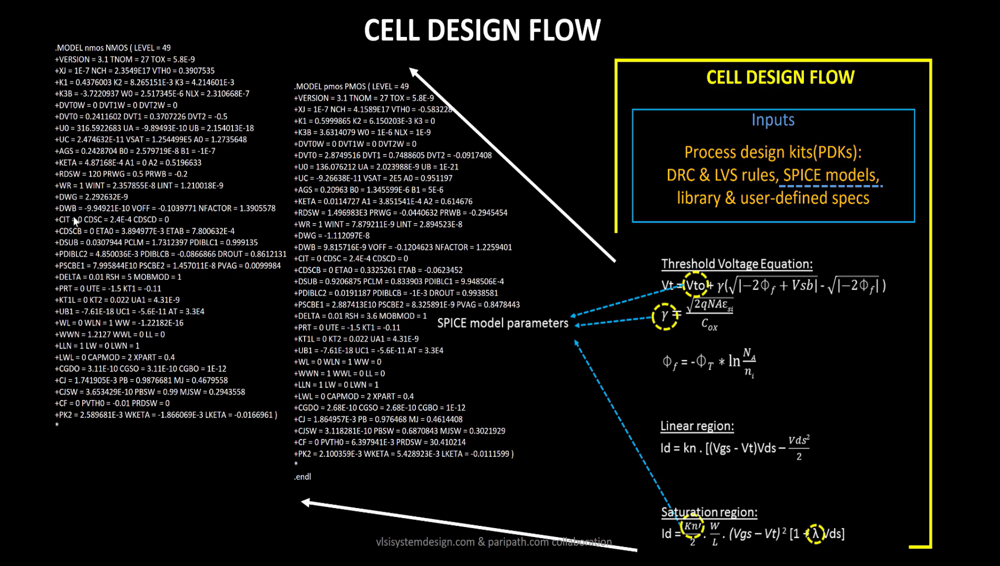

- Physical layout follows **design-rule spacing** (e.g., 6λ, 3λ contact
  rules in the lambda-based layout diagram) to guarantee manufacturability.

---

## 5. Timing Characterization

- Each standard cell (e.g., a buffer) is characterized by applying a pulse
  input (`v(in)`, red) and measuring the output response (`v(buf_out)`, blue)
  in SPICE.
- **Timing threshold definitions** used to extract delay/slew from these
  waveforms:
  - `slew_low_rise_thr`, `slew_high_rise_thr`
  - `slew_low_fall_thr`, `slew_high_fall_thr`
  - `in_rise_thr`, `in_fall_thr`
  - `out_rise_thr`, `out_fall_thr`
- These thresholds (typically at 10%/50%/90% of `Vdd`, per library spec)
  define exactly where on the rising/falling edge delay and slew are
  measured, and are the basis for generating **.lib** timing tables.

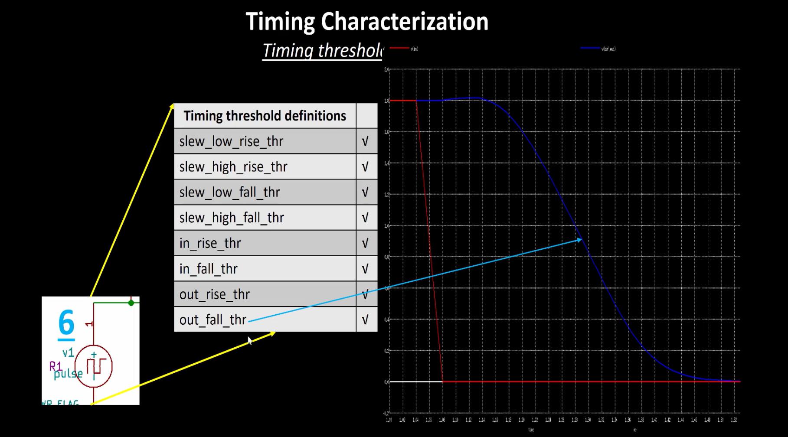

---

## Summary Flow

```
Netlist (RTL) 
   → Floorplanning (die/core, utilization, aspect ratio)
   → Preplaced macro placement (black-boxed blocks)
   → Decap placement (power integrity)
   → Standard cell placement + optimization (buffer insertion)
   → Power grid (Vdd/Vss rings & straps)
   → Placement blockages defined
   → Ready for Placement & Routing (P&R)
   → (in parallel) Standard Cell Library built from PDK + SPICE models
   → Timing characterization of each cell (.lib generation)
```


