# BabySoC — Synthesis & Simulation Walkthrough

This log documents the RTL-to-gate-level synthesis flow for the `vsdbabysoc`
design using **Yosys** (mapped to the `sky130_fd_sc_hd` standard cell
library), along with pre-synthesis vs. post-synthesis simulation
verification in **GTKWave**.

---

## 1. Design Statistics (`stat` after `read_verilog`)

Top-level hierarchy showing `avsddac`, `avsdpll`, and `rvmyth` as
sub-modules of `vsdbabysoc`, with `rvmyth` instantiating 7 `clk_gate`
cells.

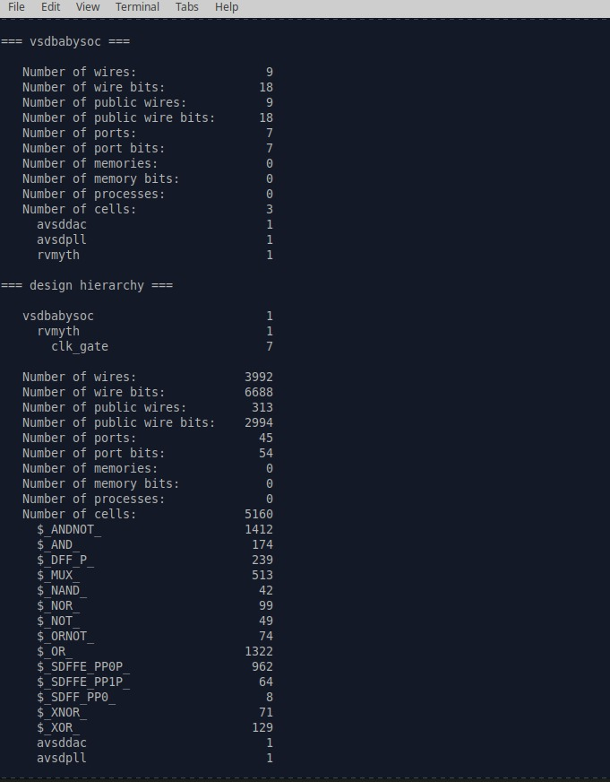

---

## 2. Generated RTL Netlist — `clk_gate` / `rvmyth` modules

Yosys-generated Verilog showing the `clk_gate` module definition and the
start of the `rvmyth` core wire declarations.

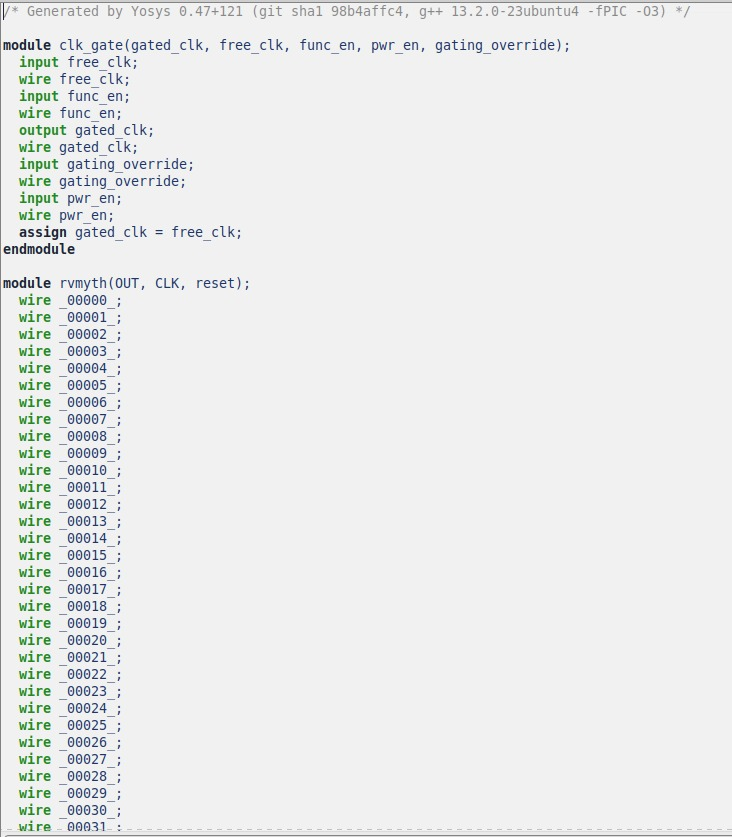

---

## 3. GTKWave — Pre-Synthesis vs. Post-Synthesis Comparison

Side-by-side waveform comparison of `pre_synth_sim.vcd` and
`post_synth_sim.vcd`, confirming matching behavior on `CLK`, `OUT`,
`RV_TO_DAC[9:0]`, and other key signals.

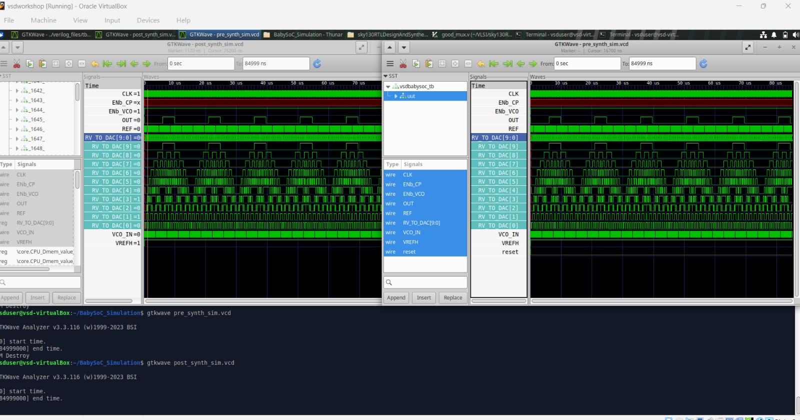

---

## 4. Netlist File in Mousepad — `baby_soc_netlist.v`

Viewing the raw generated netlist file directly in a text editor.

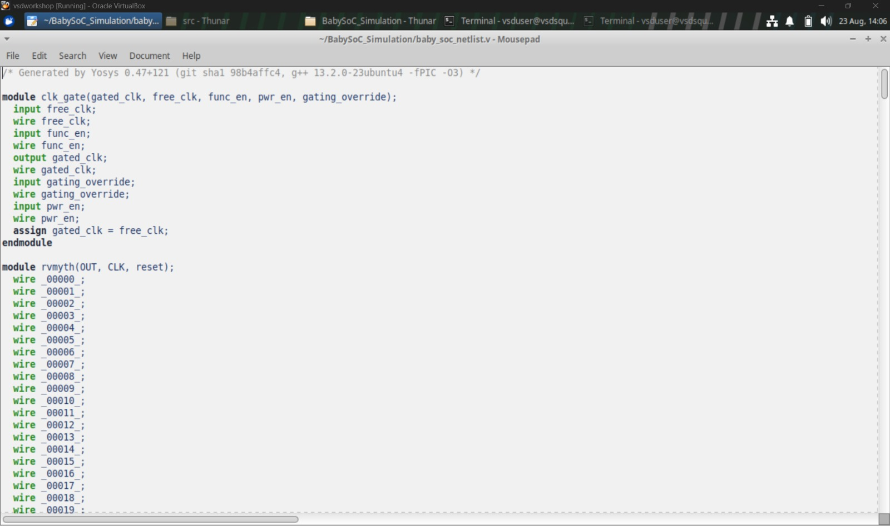

---

## 5. Yosys `stat` + `check` Pass

Full design statistics followed by the `CHECK` pass confirming
**0 problems found** across `clk_gate`, `rvmyth`, and `vsdbabysoc`.

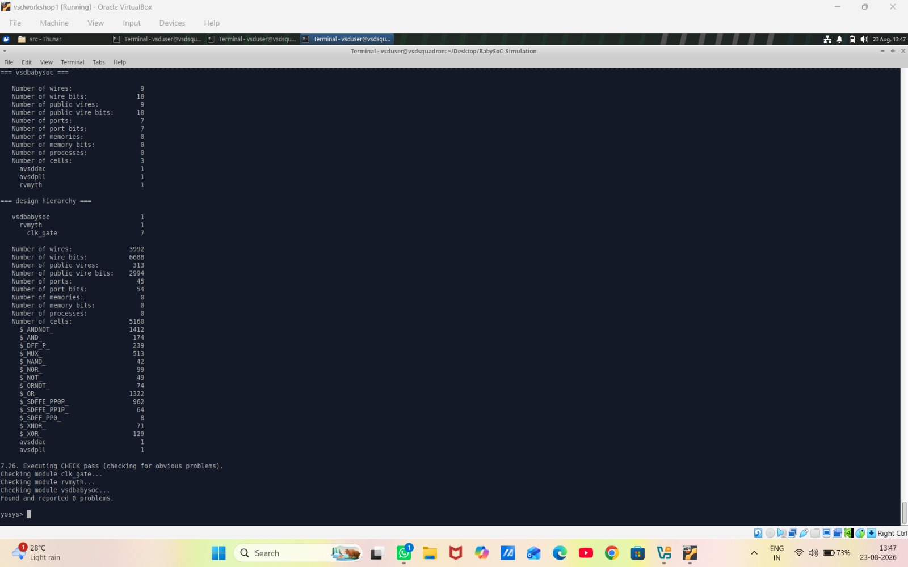

---

## 6. DFF Legalization — Mapping to `sky130_fd_sc_hd` Flip-Flops

`dfflegalize` pass mapping generic `$DFF_*` / `$DFFSR_*` cells to
technology-specific flip-flops (`dfxtp`, `dfrtp`, `dfstp`, `edfxtp`,
`dfbbn`, `dfbbp`), including 1273 `$DFF_P_` cells mapped in `rvmyth`.

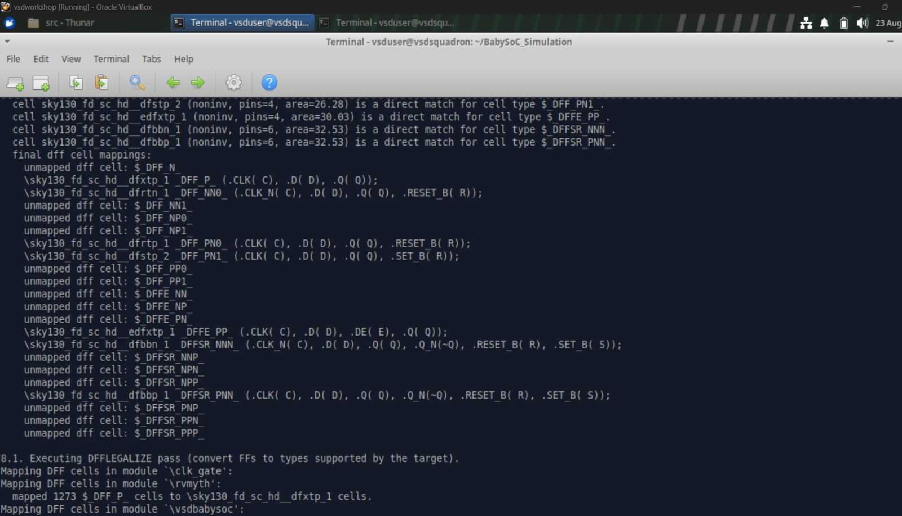

---

## 7. GTKWave — Pre vs Post Synthesis (Design Hierarchy Expanded)

Second waveform comparison with the `uut` hierarchy expanded to show
`core`, `dac`, and `pll` sub-blocks.

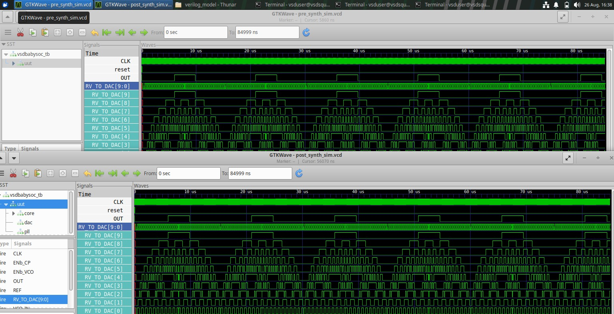

---

## 8. ABC Synthesis Results — Cell-Level Breakdown

`ABC RESULTS` summary listing the final `sky130_fd_sc_hd` cell counts
(nand2, a21oi, nor2, mux2, xor2, etc.) used to implement the design.

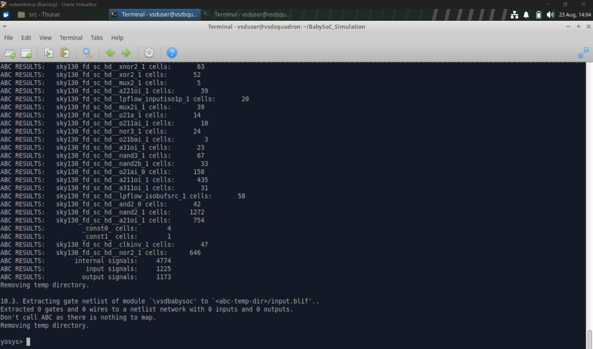

---

## 9. Yosys Optimization Passes (`opt`)

`OPT_REDUCE`, `OPT_MERGE`, `OPT_DFF`, `OPT_CLEAN`, and `OPT_EXPR` passes
completing with no further changes needed.

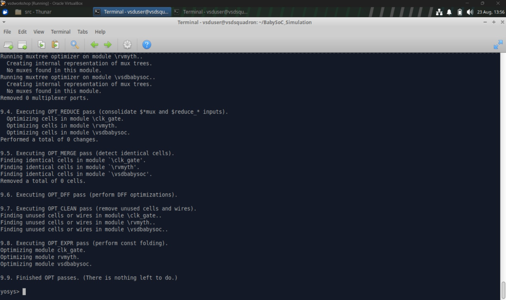

---

## 10. Comparing Two Netlist Versions Side-by-Side

`baby_soc_netlist.v` vs `baby_soc2_netlist.v` opened in separate Mousepad
tabs for comparison.

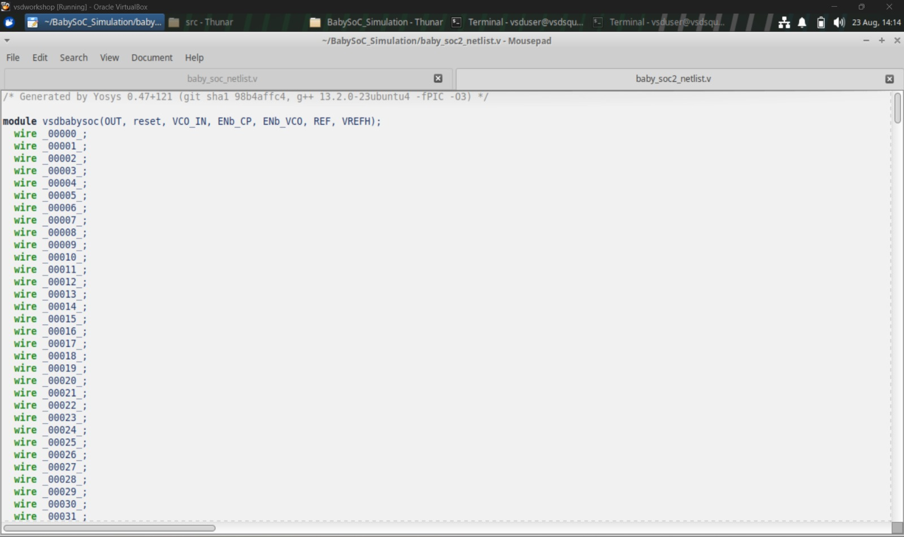

---

## 11. Final Gate-Level Netlist — `sky130_fd_sc_hd` Standard Cells

Snippet of the final mapped netlist showing instantiated `nand2`, `nor2`,
`a311oi`, and `o211ai` standard cells.

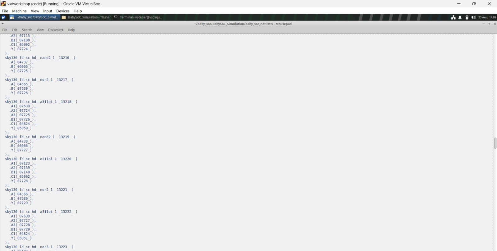

---

## 12. Standard Cell Usage Summary (Terminal)

Full reference count of every `sky130_fd_sc_hd` cell type used in the
final synthesized netlist.

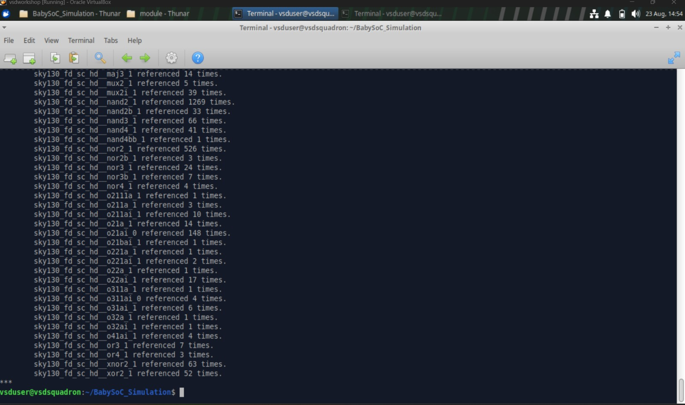

---

## 13. Testbench — `testbench.v`

Top-level testbench with `PRE_SYNTH_SIM` / `POST_SYNTH_SIM` conditional
includes, instantiating the `vsdbabysoc` DUT.

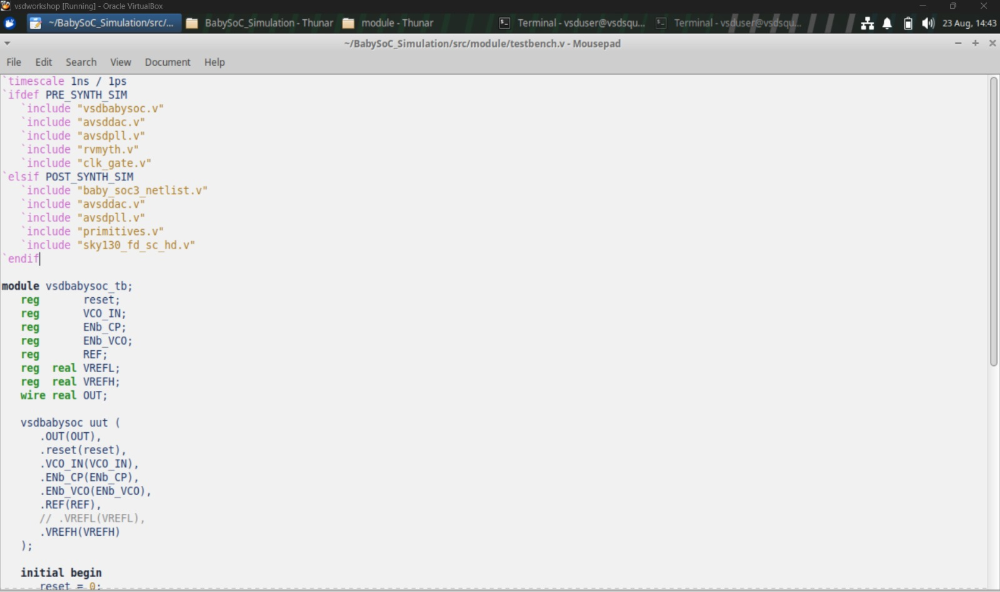

---

### Summary

| Stage | Tool | Result |
|---|---|---|
| RTL elaboration | Yosys `stat` | 5160 cells, 0 problems on `check` |
| Technology mapping | ABC + `dfflegalize` | Mapped to `sky130_fd_sc_hd` |
| Optimization | `opt_*` passes | 0 further changes (already clean) |
| Verification | GTKWave | Pre-synth vs post-synth waveforms match |
