# Open Source Digital ASIC Design — Notes on OpenLANE & RISC‑V SoC Flow

Personal study notes summarizing a talk on open-source EDA tools, RISC‑V based SoC design, and the OpenLANE RTL‑to‑GDSII flow (Sky130 PDK).

---

## 1. Background

The talk is introduced by a computer engineer and open-source EDA advocate, maintainer of tools such as **CloudV** (cloud-based Verilog IDE/simulator), **Fault** (a DFT toolchain), and **SoCGen** (SoC generation from an architectural description).

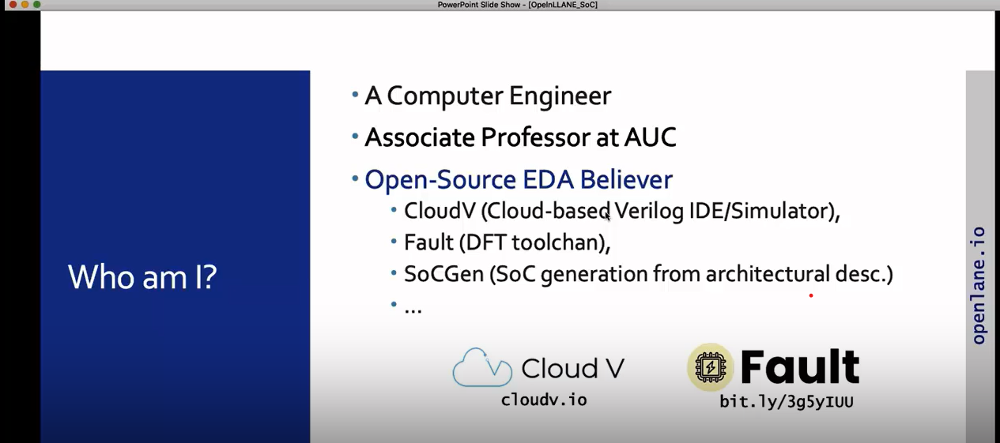

---

## 2. SoC I/O and Peripheral Planning

Before laying out a chip, the available pins/peripherals (JTAG, UART, QSPI, I2C, PWM, GPIO, ADC) need to be planned around the processor/SoC core and external SDRAM.

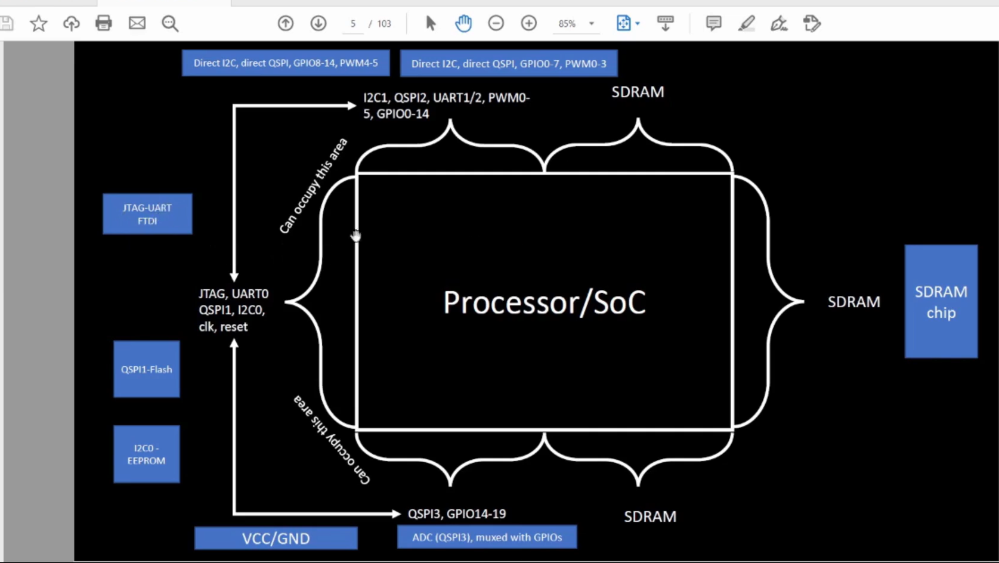

A concrete example of a RISC‑V SoC floorplan showing **macros** (GPIO bank, RISC‑V core, SRAM) and **foundry IPs** (ADC, DAC, comparator, PLL, oscillator):

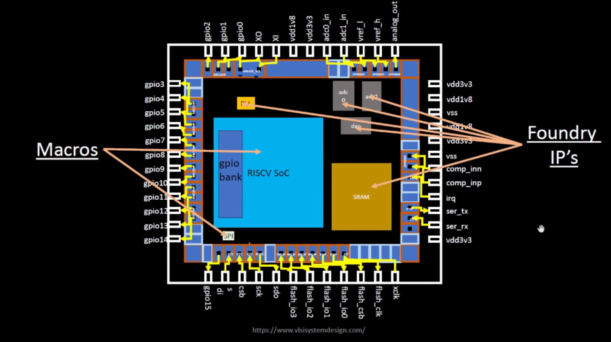

---

## 3. From Architecture to Silicon

A single instruction (e.g. `add x6, x10, x6`) is traced end-to-end: RISC‑V ISA → assembler → machine code → RTL implementation (`picorv32` core) → synthesized netlist → physical layout (via `qflow`).

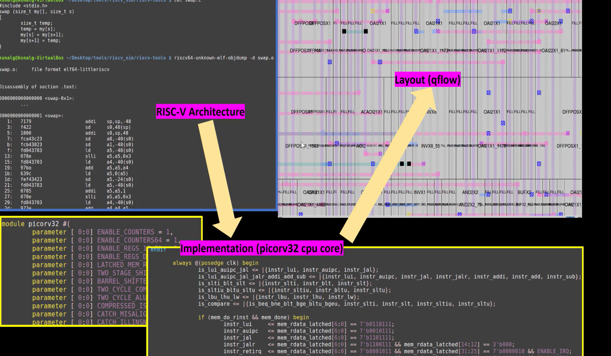

The full pipeline, restated as a flow diagram — from abstract ISA, through assembly, RTL, synthesized netlist, to physical hardware layout:

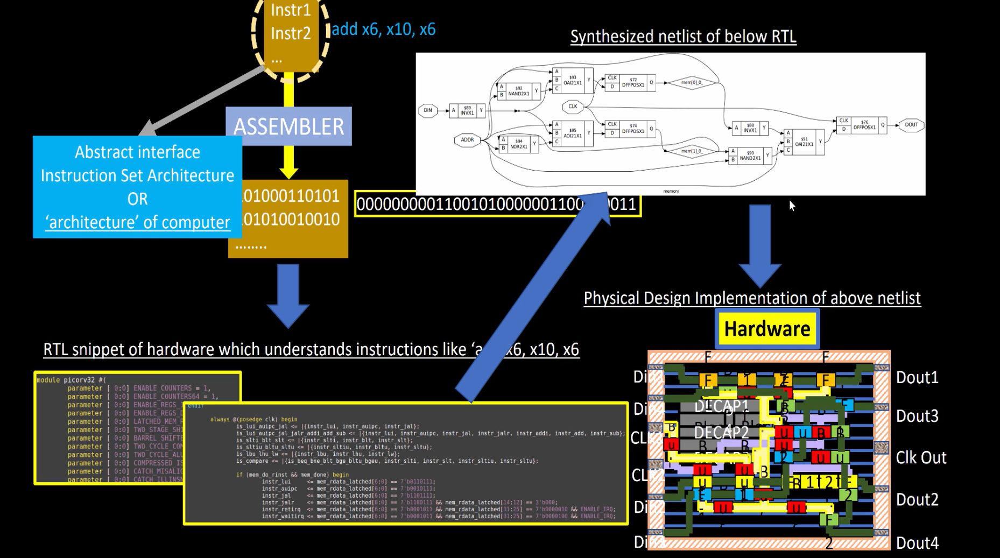

---

## 4. Open Source ASIC Design Ecosystem

Building an ASIC requires three ingredients: **RTL designs** (librecores.org, opencores.org, GitHub), **EDA tools** (Qflow, OpenROAD, OpenLANE), and **PDK data** (process design kit from the foundry).

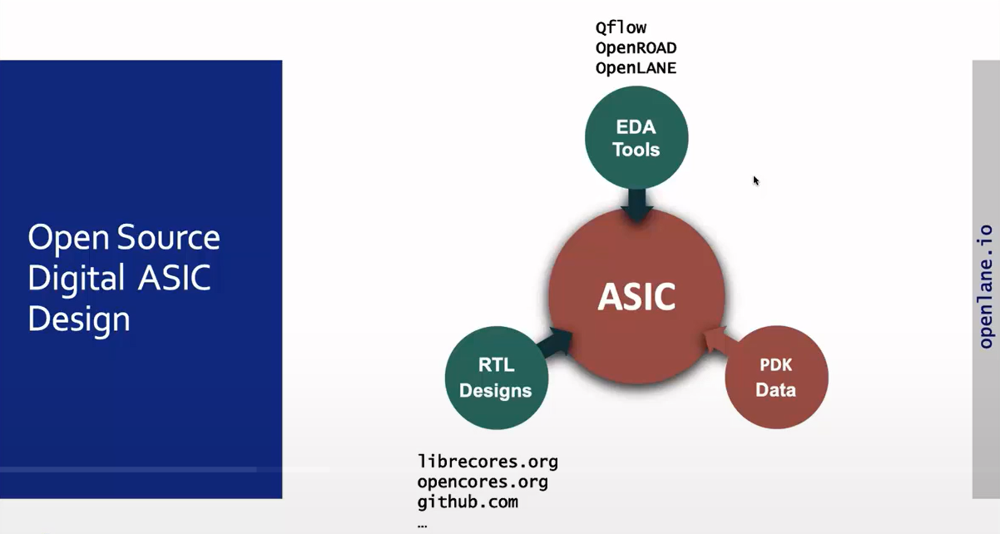

### Simplified RTL → GDSII Flow

At a high level, the flow takes RTL and a PDK through **Synthesis → Floorplan/Powerplan → Placement → Clock Tree Synthesis → Routing → Sign-off**, producing a GDSII layout file.

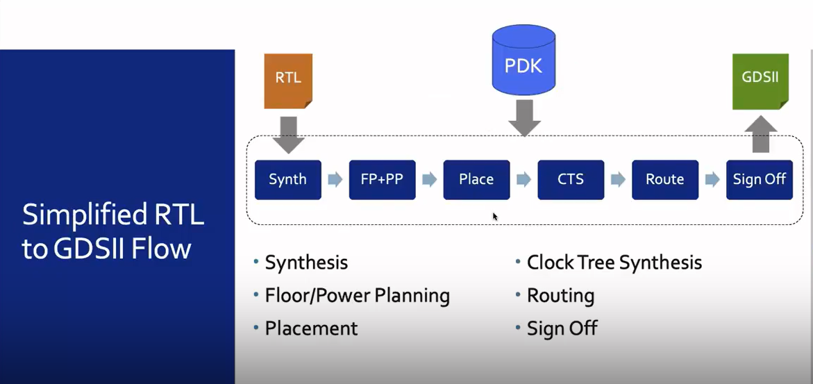

---

## 5. OpenLANE

OpenLANE began as an open-source flow for a fully open tape-out experiment. The **striVe** family of SoCs is built entirely from open PDK, open EDA, and open RTL.

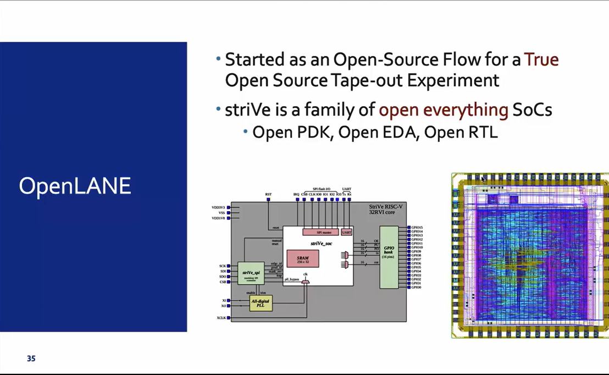

Several generations of striVe chips exist, varying in standard cell library (Sky130 vs. OSU), SRAM implementation (synthesized vs. OpenRAM), and DFT support — developed with Skywater, Google, OpenROAD, and efabless.

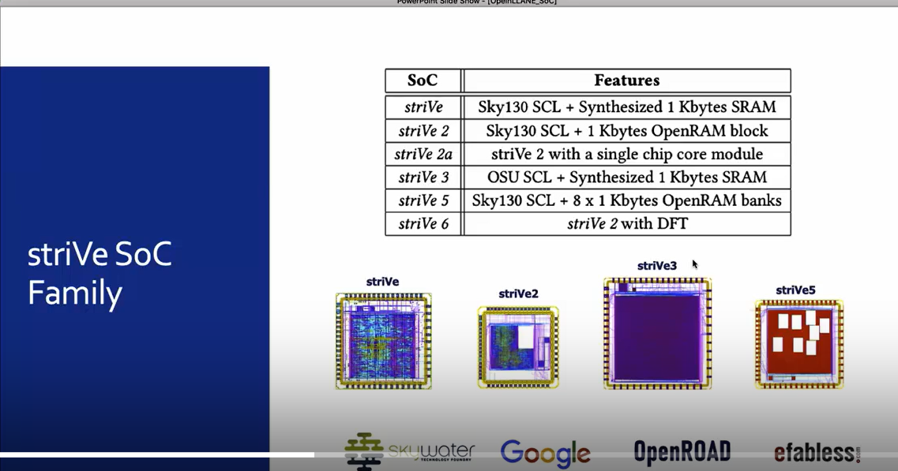

### OpenLANE ASIC Flow (Detailed)

The complete OpenLANE flow chains together RTL synthesis (Yosys + abc), STA (OpenSTA), DFT (Fault), floorplanning/placement/CTS/optimization/global routing (OpenROAD app), logical equivalence checking (Yosys), detailed routing (TritonRoute), antenna-diode fix scripts, RC extraction, physical verification (Magic & Netgen), and final GDSII streaming (Magic) — using the Sky130 PDK throughout.

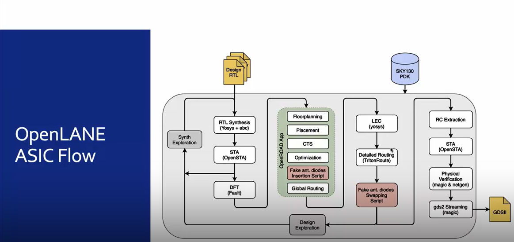

---

## 6. Design Rule Deep Dive: Antenna Violations

During fabrication, a long metal wire segment can act as an antenna: reactive ion etching accumulates charge on the wire, which can damage the transistor gate it connects to before the rest of the circuit (and its protective diodes) exist.

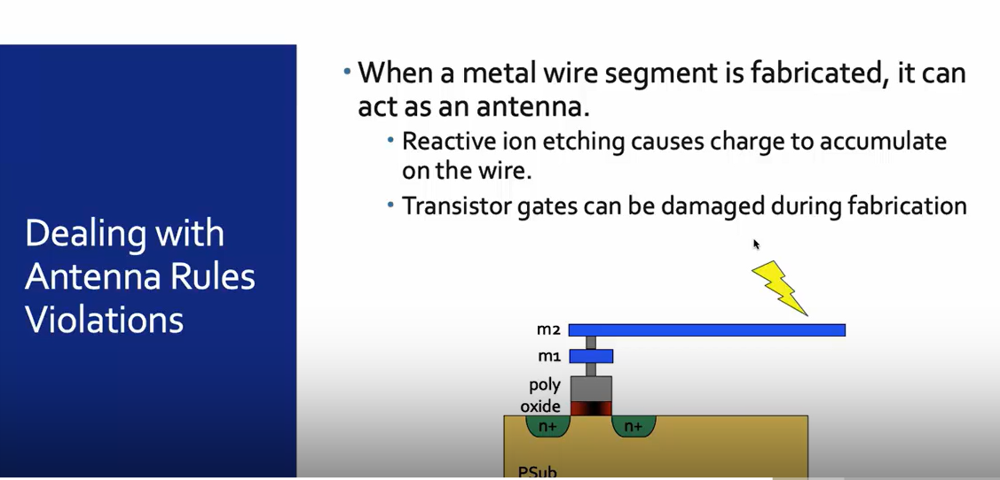

---

## 7. Hands-On: Running OpenLANE Synthesis on `picorv32a`

### Design Configuration (`config.tcl`)

The design is pointed at its Verilog source and SDC constraints, with a 5 ns clock period on port `clk`. A PDK/standard-cell-library-specific config is sourced automatically if present.

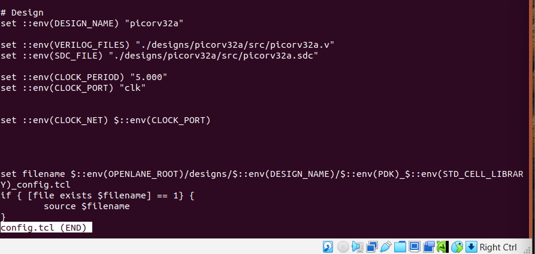

### Run Directory & Reports

After running the flow, OpenLANE produces a timestamped run directory (`runs/06-09_04-46/`) containing `results/synthesis/` (the synthesized netlist and merged unpadded LEF) and `reports/` with a subfolder per stage — `synthesis`, `floorplan`, `placement`, `cts`, `routing`, `magic`, `lvs`, `klayout`, `cvc`. The synthesis reports include Yosys stats and OpenSTA timing/slew/min-max reports.

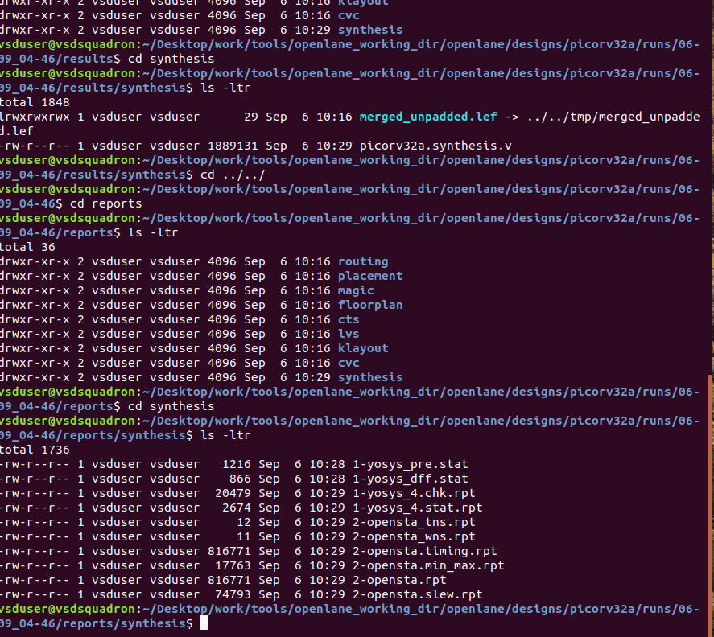

### Yosys Synthesis Statistics

The synthesized `picorv32a` netlist maps to Sky130 standard cells: **14,596 wires**, **14,876 cells total**, with a breakdown by cell type (AND/OR/NAND/NOR gates, muxes, flip-flops, buffers, inverters, etc.). Notably **1,613 `dfxtp_2`** flip-flops and **1,656 `buf_1`** buffers.

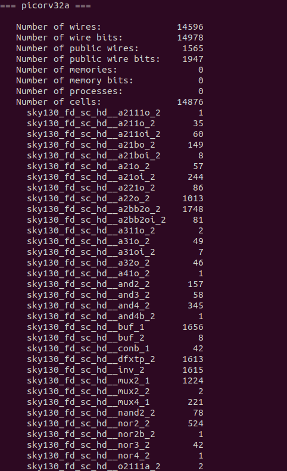

The statistics continue with more complex gates (AOI/OAI variants), and finish with the final **chip area for module `picorv32a`: 147,712.92 µm²**.

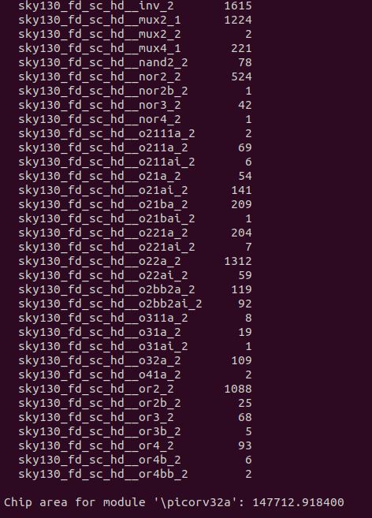

---

## Repository Structure

```
.
├── README.md
└── images/
    ├── 01-who-am-i.png
    ├── 02-soc-io-interfaces.png
    ├── 03-riscv-soc-macros-foundry-ips.png
    ├── 04-riscv-arch-implementation-layout.png
    ├── 05-rtl-to-hardware-flow.png
    ├── 06-open-source-digital-asic-design.png
    ├── 07-simplified-rtl-to-gdsii-flow.png
    ├── 08-openlane-strive-soc.png
    ├── 09-strive-soc-family.png
    ├── 10-openlane-asic-flow.png
    ├── 11-antenna-rules-violations.png
    ├── 12-picorv32a-config-tcl.png
    ├── 13-synthesis-run-reports.png
    ├── 14-yosys-cell-stats-1.png
    └── 15-yosys-cell-stats-2-chip-area.png
```

## References

- OpenLANE: https://openlane.io
- CloudV: https://cloudv.io
- Fault (DFT toolchain): https://bit.ly/3g5yIUU
