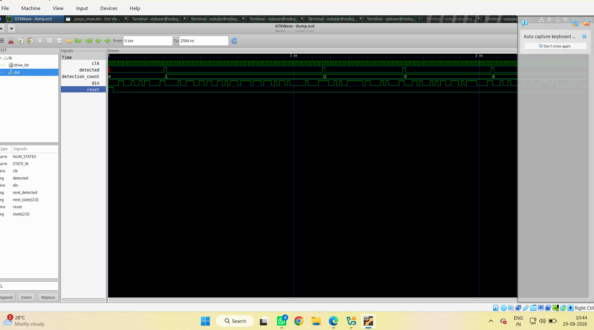
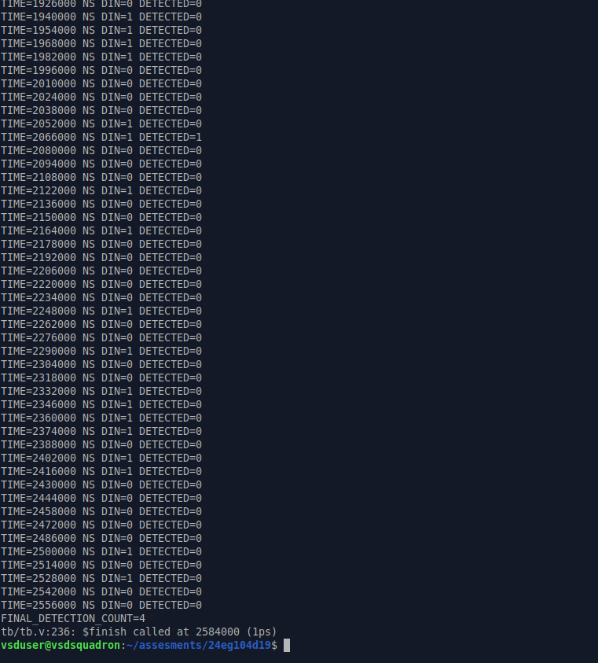
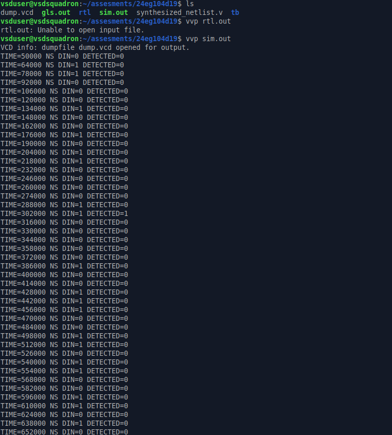
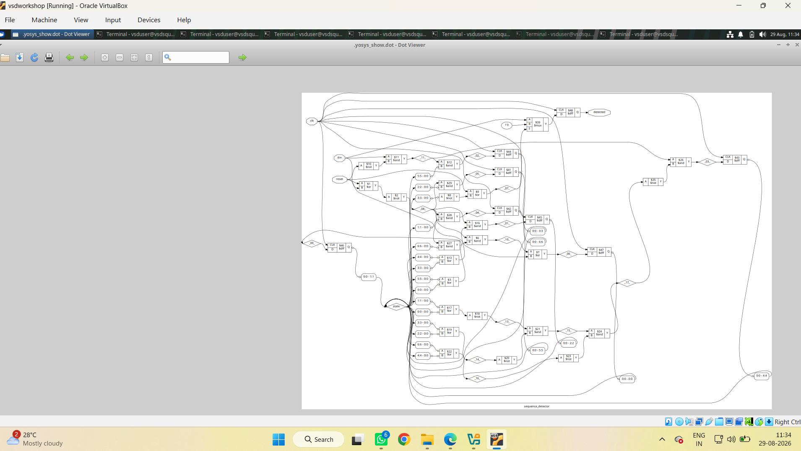
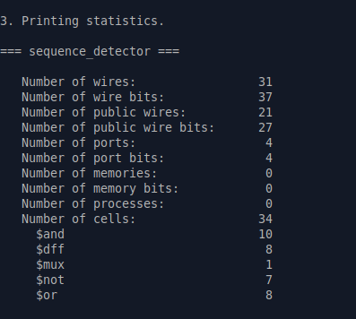

# Sequence Detector – RTL Design, Simulation and Synthesis

## 1. Project Overview

This project implements a **digital sequence detector using Verilog RTL**.  
The design was simulated, verified using GTKWave, synthesized using Yosys, and analyzed using the generated schematic and synthesis statistics.

## 2. Tools Used

- Verilog HDL
- Icarus Verilog
- GTKWave
- Yosys
- Ubuntu / VSD Workshop

## 3. Design Flow

```text
Verilog RTL
     ↓
Icarus Verilog Simulation
     ↓
VCD Waveform Generation
     ↓
GTKWave Verification
     ↓
Yosys Synthesis
     ↓
RTL / Synthesized Schematic
     ↓
Synthesis Statistics
```

## 4. Simulation Waveform

The GTKWave output shows the clock, input data (`din`), detection signal, reset, and detection count.



## 5. Final Detection Output

The simulation completed successfully and produced:

**FINAL_DETECTION_COUNT = 4**



## 6. RTL Schematic

The RTL schematic generated from the design is shown below.



## 7. Synthesized Graphical Schematic

The synthesized graphical representation of the sequence detector is shown below.



## 8. Yosys Synthesis Statistics

The synthesized `sequence_detector` module produced the following results:

| Parameter | Result |
|---|---:|
| Number of wires | 31 |
| Number of wire bits | 37 |
| Number of public wires | 21 |
| Number of public wire bits | 27 |
| Number of ports | 4 |
| Number of port bits | 4 |
| Number of memories | 0 |
| Number of memory bits | 0 |
| Number of processes | 0 |
| Number of cells | 34 |
| `$and` cells | 10 |
| `$dff` cells | 8 |
| `$mux` cells | 1 |
| `$not` cells | 7 |
| `$or` cells | 8 |

### Statistics Screenshot



## 9. Key Observations

- The synthesis check reported **0 problems**.
- The design contains **8 D flip-flops (`$dff`)** for sequential state storage.
- The combinational logic contains AND, OR, NOT, and MUX cells.
- The final simulation produced **4 detections**.
- The synthesized design contains **34 total cells**.

## 10. Conclusion

The sequence detector was successfully:

1. Designed in Verilog RTL.
2. Simulated using Icarus Verilog.
3. Verified using GTKWave.
4. Synthesized using Yosys.
5. Checked for synthesis errors.
6. Analyzed using RTL and synthesized schematics.
7. Verified using synthesis statistics.


